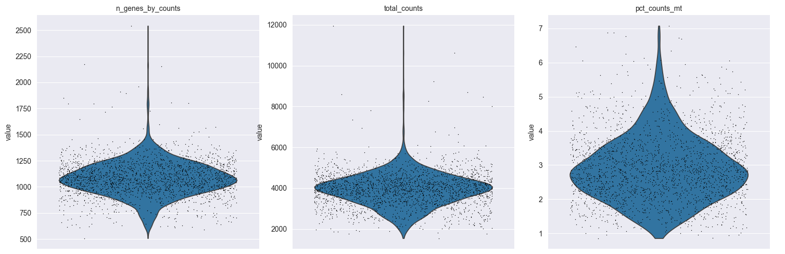
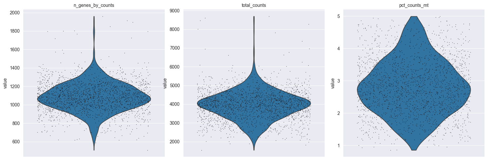
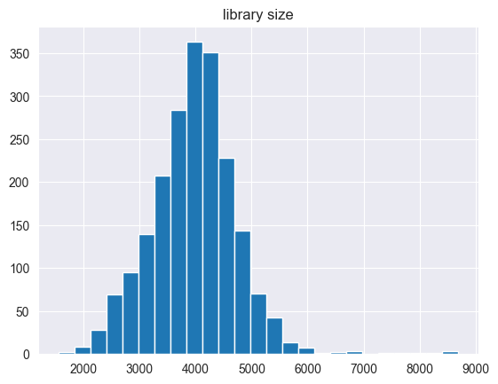
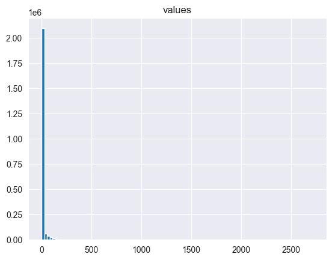

```python
import anndata as ad
import numpy as np
import pandas as pd
import scanpy as sc
```

Single Cell RNA


```python
scdr = ad.read_h5ad('/Users/.../XN3hBs-uQD6IeUdJ2CYZOA_e960b340b10b4501915fc5730613d2e1_scdr.h5ad')
scdr
```


    AnnData object with n_obs × n_vars = 5016 × 20953
        obs: 'cell.type', 'cytokine.condition', 'donor.id', 'batch.10X', 'nGene', 'nUMI', 'percent.mito', 'S.Score', 'G2M.Score', 'Phase', 'cluster.id', 'effectorness'


```python
scdr.X
```


    <Compressed Sparse Column sparse matrix of dtype 'float32'
    	with 5709539 stored elements and shape (5016, 20953)>


```python
print(scdr.X.shape)
```

    (5016, 20953)


```python
#first 10 highest expression values
np.flip(np.sort(scdr.X.data)) [range(10)]
```


    array([1130.,  981.,  955.,  911.,  887.,  883.,  859.,  832.,  830.,
            810.], dtype=float32)


```python
#Observe the data frame
scdr.obs
```


<div>
<style scoped>
    .dataframe tbody tr th:only-of-type {
        vertical-align: middle;
    }

    .dataframe tbody tr th {
        vertical-align: top;
    }

    .dataframe thead th {
        text-align: right;
    }
</style>
<table border="1" class="dataframe">
  <thead>
    <tr style="text-align: right;">
      <th></th>
      <th>cell.type</th>
      <th>cytokine.condition</th>
      <th>donor.id</th>
      <th>batch.10X</th>
      <th>nGene</th>
      <th>nUMI</th>
      <th>percent.mito</th>
      <th>S.Score</th>
      <th>G2M.Score</th>
      <th>Phase</th>
      <th>cluster.id</th>
      <th>effectorness</th>
    </tr>
  </thead>
  <tbody>
    <tr>
      <th>N_resting_AAACCTGAGCTGTCTA</th>
      <td>Naive</td>
      <td>UNS</td>
      <td>D4</td>
      <td>2</td>
      <td>1163</td>
      <td>4172</td>
      <td>0.023496</td>
      <td>-0.134199</td>
      <td>-0.159211</td>
      <td>G1</td>
      <td>TN (resting)</td>
      <td>0.151812</td>
    </tr>
    <tr>
      <th>N_resting_AAACCTGTCACCACCT</th>
      <td>Naive</td>
      <td>UNS</td>
      <td>D4</td>
      <td>2</td>
      <td>1037</td>
      <td>3690</td>
      <td>0.020867</td>
      <td>-0.101756</td>
      <td>-0.203707</td>
      <td>G1</td>
      <td>TN (resting)</td>
      <td>0.031763</td>
    </tr>
    <tr>
      <th>N_resting_AAACCTGTCCGTTGTC</th>
      <td>Naive</td>
      <td>UNS</td>
      <td>D2</td>
      <td>2</td>
      <td>1245</td>
      <td>4446</td>
      <td>0.027903</td>
      <td>-0.145131</td>
      <td>-0.164210</td>
      <td>G1</td>
      <td>TN (resting)</td>
      <td>0.113897</td>
    </tr>
    <tr>
      <th>N_resting_AAACGGGAGGGTTCCC</th>
      <td>Naive</td>
      <td>UNS</td>
      <td>D4</td>
      <td>2</td>
      <td>1016</td>
      <td>3913</td>
      <td>0.011509</td>
      <td>-0.069492</td>
      <td>-0.190810</td>
      <td>G1</td>
      <td>TN (resting)</td>
      <td>0.341240</td>
    </tr>
    <tr>
      <th>N_resting_AAACGGGCAACAACCT</th>
      <td>Naive</td>
      <td>UNS</td>
      <td>D1</td>
      <td>2</td>
      <td>1005</td>
      <td>3557</td>
      <td>0.039640</td>
      <td>-0.124007</td>
      <td>-0.143379</td>
      <td>G1</td>
      <td>TN (resting)</td>
      <td>0.019741</td>
    </tr>
    <tr>
      <th>...</th>
      <td>...</td>
      <td>...</td>
      <td>...</td>
      <td>...</td>
      <td>...</td>
      <td>...</td>
      <td>...</td>
      <td>...</td>
      <td>...</td>
      <td>...</td>
      <td>...</td>
      <td>...</td>
    </tr>
    <tr>
      <th>M_resting_r2_TGCTGCTCAATGTAAG</th>
      <td>Memory</td>
      <td>UNS</td>
      <td>D4</td>
      <td>2</td>
      <td>1235</td>
      <td>2936</td>
      <td>0.031357</td>
      <td>-0.160865</td>
      <td>-0.179502</td>
      <td>G1</td>
      <td>TCM (resting)</td>
      <td>0.729563</td>
    </tr>
    <tr>
      <th>M_resting_r2_CAGCCGATCAGTTTGG</th>
      <td>Memory</td>
      <td>UNS</td>
      <td>D3</td>
      <td>2</td>
      <td>1128</td>
      <td>3690</td>
      <td>0.027672</td>
      <td>-0.064889</td>
      <td>-0.172590</td>
      <td>G1</td>
      <td>TN (resting)</td>
      <td>0.255955</td>
    </tr>
    <tr>
      <th>M_resting_r1_AGAGCTTCATCTCCCA</th>
      <td>Memory</td>
      <td>UNS</td>
      <td>D2</td>
      <td>2</td>
      <td>1058</td>
      <td>3222</td>
      <td>0.038820</td>
      <td>-0.078151</td>
      <td>-0.206662</td>
      <td>G1</td>
      <td>TCM (resting)</td>
      <td>0.478484</td>
    </tr>
    <tr>
      <th>M_resting_r2_AAGCCGCCATCGTCGG</th>
      <td>Memory</td>
      <td>UNS</td>
      <td>D2</td>
      <td>2</td>
      <td>1188</td>
      <td>3892</td>
      <td>0.036999</td>
      <td>-0.155572</td>
      <td>-0.139277</td>
      <td>G1</td>
      <td>TEM (resting)</td>
      <td>0.813737</td>
    </tr>
    <tr>
      <th>M_resting_r2_CACCAGGAGTGGCACA</th>
      <td>Memory</td>
      <td>UNS</td>
      <td>D1</td>
      <td>2</td>
      <td>919</td>
      <td>1998</td>
      <td>0.001515</td>
      <td>-0.034627</td>
      <td>-0.063464</td>
      <td>G1</td>
      <td>TCM (resting)</td>
      <td>0.307760</td>
    </tr>
  </tbody>
</table>
<p>5016 rows × 12 columns</p>
</div>


```python
#Selecting the naive T-Cells only
ids = scdr.obs['cell.type'] == 'Naive'
scdr = scdr[ids, :]
scdr
```


    View of AnnData object with n_obs × n_vars = 2141 × 20953
        obs: 'cell.type', 'cytokine.condition', 'donor.id', 'batch.10X', 'nGene', 'nUMI', 'percent.mito', 'S.Score', 'G2M.Score', 'Phase', 'cluster.id', 'effectorness'


```python
#summing over the first axis/Dimentions
num_reads =scdr.X.sum(axis=0)
num_reads
```


    matrix([[  3., 263.,  97., ...,   0.,   0.,   0.]],
           shape=(1, 20953), dtype=float32)


```python
#See again how many rows left
scdr.obs
```


<div>
<style scoped>
    .dataframe tbody tr th:only-of-type {
        vertical-align: middle;
    }

    .dataframe tbody tr th {
        vertical-align: top;
    }

    .dataframe thead th {
        text-align: right;
    }
</style>
<table border="1" class="dataframe">
  <thead>
    <tr style="text-align: right;">
      <th></th>
      <th>cell.type</th>
      <th>cytokine.condition</th>
      <th>donor.id</th>
      <th>batch.10X</th>
      <th>nGene</th>
      <th>nUMI</th>
      <th>percent.mito</th>
      <th>S.Score</th>
      <th>G2M.Score</th>
      <th>Phase</th>
      <th>cluster.id</th>
      <th>effectorness</th>
    </tr>
  </thead>
  <tbody>
    <tr>
      <th>N_resting_AAACCTGAGCTGTCTA</th>
      <td>Naive</td>
      <td>UNS</td>
      <td>D4</td>
      <td>2</td>
      <td>1163</td>
      <td>4172</td>
      <td>0.023496</td>
      <td>-0.134199</td>
      <td>-0.159211</td>
      <td>G1</td>
      <td>TN (resting)</td>
      <td>0.151812</td>
    </tr>
    <tr>
      <th>N_resting_AAACCTGTCACCACCT</th>
      <td>Naive</td>
      <td>UNS</td>
      <td>D4</td>
      <td>2</td>
      <td>1037</td>
      <td>3690</td>
      <td>0.020867</td>
      <td>-0.101756</td>
      <td>-0.203707</td>
      <td>G1</td>
      <td>TN (resting)</td>
      <td>0.031763</td>
    </tr>
    <tr>
      <th>N_resting_AAACCTGTCCGTTGTC</th>
      <td>Naive</td>
      <td>UNS</td>
      <td>D2</td>
      <td>2</td>
      <td>1245</td>
      <td>4446</td>
      <td>0.027903</td>
      <td>-0.145131</td>
      <td>-0.164210</td>
      <td>G1</td>
      <td>TN (resting)</td>
      <td>0.113897</td>
    </tr>
    <tr>
      <th>N_resting_AAACGGGAGGGTTCCC</th>
      <td>Naive</td>
      <td>UNS</td>
      <td>D4</td>
      <td>2</td>
      <td>1016</td>
      <td>3913</td>
      <td>0.011509</td>
      <td>-0.069492</td>
      <td>-0.190810</td>
      <td>G1</td>
      <td>TN (resting)</td>
      <td>0.341240</td>
    </tr>
    <tr>
      <th>N_resting_AAACGGGCAACAACCT</th>
      <td>Naive</td>
      <td>UNS</td>
      <td>D1</td>
      <td>2</td>
      <td>1005</td>
      <td>3557</td>
      <td>0.039640</td>
      <td>-0.124007</td>
      <td>-0.143379</td>
      <td>G1</td>
      <td>TN (resting)</td>
      <td>0.019741</td>
    </tr>
    <tr>
      <th>...</th>
      <td>...</td>
      <td>...</td>
      <td>...</td>
      <td>...</td>
      <td>...</td>
      <td>...</td>
      <td>...</td>
      <td>...</td>
      <td>...</td>
      <td>...</td>
      <td>...</td>
      <td>...</td>
    </tr>
    <tr>
      <th>N_resting_TTTGCGCAGGAGTCTG</th>
      <td>Naive</td>
      <td>UNS</td>
      <td>D1</td>
      <td>2</td>
      <td>980</td>
      <td>3233</td>
      <td>0.046720</td>
      <td>-0.048484</td>
      <td>-0.172172</td>
      <td>G1</td>
      <td>TEMRA (resting)</td>
      <td>0.837294</td>
    </tr>
    <tr>
      <th>N_resting_TTTGTCAAGGATCGCA</th>
      <td>Naive</td>
      <td>UNS</td>
      <td>D1</td>
      <td>2</td>
      <td>754</td>
      <td>2016</td>
      <td>0.051091</td>
      <td>-0.122710</td>
      <td>-0.161167</td>
      <td>G1</td>
      <td>TEMRA (resting)</td>
      <td>0.903606</td>
    </tr>
    <tr>
      <th>N_resting_TTTGTCAGTCCGTCAG</th>
      <td>Naive</td>
      <td>UNS</td>
      <td>D1</td>
      <td>2</td>
      <td>964</td>
      <td>2725</td>
      <td>0.037826</td>
      <td>-0.109837</td>
      <td>-0.196064</td>
      <td>G1</td>
      <td>TEMRA (resting)</td>
      <td>0.914887</td>
    </tr>
    <tr>
      <th>N_resting_TTTGTCAGTGCTTCTC</th>
      <td>Naive</td>
      <td>UNS</td>
      <td>D1</td>
      <td>2</td>
      <td>1027</td>
      <td>3003</td>
      <td>0.052316</td>
      <td>-0.144304</td>
      <td>-0.225455</td>
      <td>G1</td>
      <td>TEMRA (resting)</td>
      <td>0.869464</td>
    </tr>
    <tr>
      <th>N_resting_TACGGTACATCGATGT</th>
      <td>Naive</td>
      <td>UNS</td>
      <td>D2</td>
      <td>2</td>
      <td>1267</td>
      <td>2428</td>
      <td>0.014421</td>
      <td>-0.094698</td>
      <td>-0.127492</td>
      <td>G1</td>
      <td>TCM (resting)</td>
      <td>0.465100</td>
    </tr>
  </tbody>
</table>
<p>2141 rows × 12 columns</p>
</div>


```python
#create the vars data frame
scdr.var = pd.DataFrame({'num_reads':np.array(num_reads).flatten()}, index=scdr.var_names)
scdr.var
```


<div>
<style scoped>
    .dataframe tbody tr th:only-of-type {
        vertical-align: middle;
    }

    .dataframe tbody tr th {
        vertical-align: top;
    }

    .dataframe thead th {
        text-align: right;
    }
</style>
<table border="1" class="dataframe">
  <thead>
    <tr style="text-align: right;">
      <th></th>
      <th>num_reads</th>
    </tr>
  </thead>
  <tbody>
    <tr>
      <th>RP11-34P13.7</th>
      <td>3.0</td>
    </tr>
    <tr>
      <th>FO538757.2</th>
      <td>263.0</td>
    </tr>
    <tr>
      <th>AP006222.2</th>
      <td>97.0</td>
    </tr>
    <tr>
      <th>RP4-669L17.10</th>
      <td>9.0</td>
    </tr>
    <tr>
      <th>RP11-206L10.9</th>
      <td>39.0</td>
    </tr>
    <tr>
      <th>...</th>
      <td>...</td>
    </tr>
    <tr>
      <th>MEF2B</th>
      <td>0.0</td>
    </tr>
    <tr>
      <th>AC002398.12</th>
      <td>0.0</td>
    </tr>
    <tr>
      <th>AC005625.1</th>
      <td>0.0</td>
    </tr>
    <tr>
      <th>AC115522.3</th>
      <td>0.0</td>
    </tr>
    <tr>
      <th>KCNJ6</th>
      <td>0.0</td>
    </tr>
  </tbody>
</table>
<p>20953 rows × 1 columns</p>
</div>


```python
#show scdr content
scdr
```


    AnnData object with n_obs × n_vars = 2141 × 20953
        obs: 'cell.type', 'cytokine.condition', 'donor.id', 'batch.10X', 'nGene', 'nUMI', 'percent.mito', 'S.Score', 'G2M.Score', 'Phase', 'cluster.id', 'effectorness'
        var: 'num_reads'


```python
# importing the os module for managing file directrories
import os

#create a directory for starting the new data
if not os.path.exists('output_data'):
    os.makedirs('output_data')

#write h5ad objects
scdr.write_h5ad('output_data/scdr_naive_cells.h5ad')
# check the content of the directory
os.listdir('output_data')
```


    ['scdr_naive_cells.h5ad', 'csvs']


The function above is used to open large amount of data in short term. it regards the pathways


```python
#using the write csv function
scdr.write_csvs('output_data/csvs', skip_data=True)

# listing all the written files
os.listdir('output_data/csvs')

```


    ['obs.csv', 'obsm.csv', 'var.csv', 'varm.csv', 'uns']


The graph that you have explains the process of data analysis:
First raw data: overview that explain how the data is distreputed and at this stage all values even the ones you don't need do exsit at this point same with NA values and any outliers
Second Normalziation: same as the name suggest
Third log transformation: help stabilize the measurement and explain the virables
Fourth regression out confounders: the measuremnt affected by more than one confounders. We have negitave values at this points
Lastly scaling: for analysis and help greatly with visulization

*Processing scRNA-seq data*


```python
#filtring cells
sc.pp.filter_cells(scdr, min_counts=200)
(scdr.n_obs, scdr.n_vars)
```


    (2141, 20953)


```python
#filtring gense
sc.pp.filter_genes(scdr, min_counts=3)
(scdr.n_obs, scdr.n_vars)
```


    (2141, 13610)


For a future note: gense got eleminated unlike the cells
gense got filtered due to having few cells in them


```python
#the names of the mitoconderial genes MT then create a boolean column in the var data frame to identify them
scdr.var['mt'] = scdr.var_names.str.startswith('MT-')
#the following function will compute the percentage of the MT reads for each cell
sc.pp.calculate_qc_metrics(scdr, qc_vars=['mt'], percent_top= None, log1p=False, inplace=True)

```


```python
sc.pl.violin(scdr, ['n_genes_by_counts', 'total_counts', 'pct_counts_mt'], jitter=0.4, multi_panel= True)

```


    

    


The graph above is used to evaluate the dataset based on this graph
The first graph explain how many genes expressed in a cell
the total number of reads in the every cell as seen in graph one and this explain or view the expression of quality control regarding the data (mean of 1000)

in graph 2 the number of reads are decreased bcause it is filtered and in graph 3 has a huge number of reads

These differ dependent on the data type you want to observe like what to filter and what to keep it is not the same with each one


```python
scdr.obs.columns

```


    Index(['cell.type', 'cytokine.condition', 'donor.id', 'batch.10X', 'nGene',
           'nUMI', 'percent.mito', 'S.Score', 'G2M.Score', 'Phase', 'cluster.id',
           'effectorness', 'n_counts', 'n_genes_by_counts', 'total_counts',
           'total_counts_mt', 'pct_counts_mt'],
          dtype='object')


```python
#Filter out possible doublets
scdr = scdr[scdr.obs.n_genes_by_counts < 2000, :].copy()
[scdr.n_obs, scdr.n_vars]
```


    [2138, 13610]


```python
#Filter out cells possible affected by contamination
scdr = scdr[scdr.obs.pct_counts_mt < 5, :].copy()
[scdr.n_obs, scdr.n_vars]
```


    [2068, 13610]


```python
sc.pl.violin(scdr, ['n_genes_by_counts', 'total_counts', 'pct_counts_mt'], jitter=0.4, multi_panel= True)

```


    

    


The new graph showes the filterd results which is more accurate of the one needed to measure

*Moving to standart pre-processing pipline*
This is important in large data to make sense of the reults


```python
#summing reads for each cells
library_size = scdr.X.sum(axis=1)
#transforming in a panda data frame
library_size = pd.DataFrame({'library size':np.array(library_size).flatten()}, index=scdr.obs_names)
#plotting the graph
tmp = library_size.hist(bins = 25)

```


    

    


```python
# filtering step
sc.pp.filter_genes(scdr, min_counts=3)
```


```python
#Normalization of data
sc.pp.normalize_total(scdr, target_sum=1e4)
#New library size
library_size = scdr.X.sum(axis=1)
(library_size.min(), library_size.max())
```


    (np.float32(9999.997), np.float32(10000.002))


```python
#Histo for all the values
tmp = np.array(scdr.X.todense().flatten())
tmp = tmp[tmp>0]
tmp = pd.DataFrame({'values': tmp}).hist(bins = 100)

```


    

    


The end result of this part seen in the gragh above. Most of the genes the level of expression is expected to be low.
